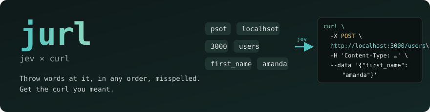
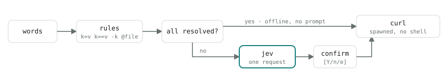

<p align="center">
  
</p>

<p align="center">
  <b>jurl</b> turns a loose pile of words — misspelled, split, out of order — into the HTTP request you meant, then runs it with curl.
</p>

<p align="center">
  
</p>

```sh
$ jurl psot localhsot 3000 users first_name amanda

curl \
  -sS \
  -X POST \
  http://localhost:3000/users \
  -H 'Content-Type: application/json' \
  -H 'Accept: application/json' \
  --data '{"first_name":"amanda"}'

run this? (interpreted by jev, confidence 0.98) [Y/n/e]
```

Typos (`psot`, `localhsot`), a bare port (`3000`), a key and value as two words (`first_name amanda`). Any order gives the same curl.

## How it works

<p align="center">
  
</p>

- **rules** — shapes like `post`, `k=v`, `k==v`, `Name:value`, `@file`, `-k` are decided in code. If every word resolves, jurl runs offline with no prompt.
- **jev** — anything left over goes to [jev](https://openrouter.ai) (TypeSafe System One, via OpenRouter) in **one request**: "what is the role of each word?" jev only picks from fixed choices and returns probabilities; it never generates the curl string.
- **confirm** — whenever jev was involved, jurl shows the curl before running. `e` opens it in `$EDITOR`. Below a confidence floor it refuses to run as is.

One call is 200–600 ms and under $0.0002.

## Setup

```sh
cargo install --path .
jurl setup        # store your OpenRouter API key in ~/.config/jurl/config.toml (0600)
jurl demo         # 12 examples against public APIs, pick with ↑↓
```

`OPENROUTER_API_KEY` in the environment takes precedence. curl must be on `PATH`.

## Grammar

| you write | it means |
|---|---|
| `get` `post` `put` … | method (default: POST with a body, GET without) |
| `localhost` `:3000/users` `api.example.com/x` | URL (https by default; localhost and private IPs get http) |
| `json` `form` `multipart` | Content-Type (default json) |
| `a.b=1` `a[0]=x` | body field, string |
| `a:=1` `a:=true` | body field, JSON literal |
| `k==v` | query parameter |
| `Name:value` | header (never sent to jev) |
| `@file` | body from a file |
| `-k` `--max-time 5` | passed to curl untouched |
| anything else | jev decides. Split values like `title hello world` are joined back into one |

| flag | |
|---|---|
| `-n` | print the curl and exit |
| `--explain` | per-word role, confidence, and whether a rule or jev decided it |
| `-y` | skip the confirmation |
| `--body` / `--raw` | no headers / no formatting |

## Output

On a terminal, the same order as httpie: status line, response headers, blank line, body (JSON pretty-printed and colored). Piped, you get the body only. The exit code is curl's.

## Config (optional)

`~/.config/jurl/config.toml`

```toml
[jev]
confirm = "jev"          # "jev" | "confidence" | "never"
confirm_below = 0.8
reject_below = 0.5

[defaults]
curl_args = ["--max-time", "30"]

[aliases]
lh = "localhost"
tok = "Authorization:Bearer $TOKEN"
```

---

<p align="center"><sub>More inputs in <a href="EXAMPLES.md">EXAMPLES.md</a>. Each module in <code>src/</code> starts with a comment on what it does. The jev wire format follows eg-jev's <code>packages/recipes/src/lib/{openrouter,questions}.ts</code>.</sub></p>
